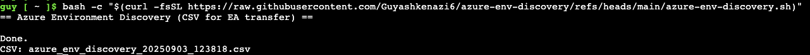
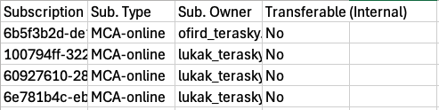
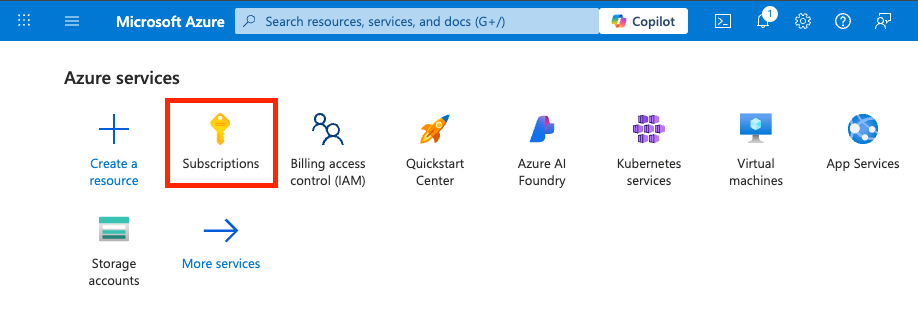
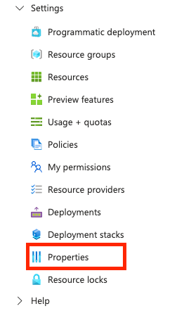
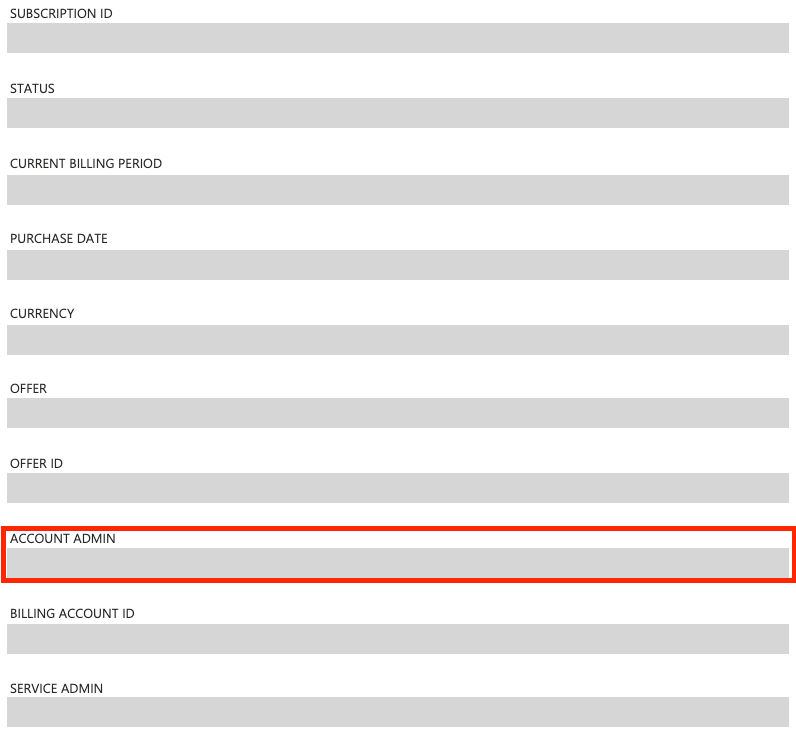

# Azure Environment Discovery

## 🎯 Purpose
This script collects **high-level information** about your Azure environment so we can quickly understand **who owns what** and **what type of subscriptions** you run—without touching any resources.

It identifies:

- **Tenant & subscriptions** (IDs and states)
- **Subscription type (Offer)** – e.g., **MSDN**, **Pay-As-You-Go (MOSP)**, **EA**, **MCA**, **CSP**
- **Owner**:
  - **Classic subscriptions (MSDN / PAYG / legacy EA):** returns the **Account Admin** (when visible via API) or tells you exactly where to check in the portal
  - **MCA:** returns **Billing Owner** if you have Billing Reader; otherwise guidance
  - **CSP:** marks as partner-managed
- **Transferable (Internal)** – quick Yes/No per Microsoft’s rules for transferring to **EA**

> ✅ The script is **READ-ONLY**. It does not modify or delete anything.

---

## ✅ Prerequisites

For best results, make sure your user has:

- **Reader** on the subscriptions you want to map  
- **Billing Reader** on the relevant **Billing Account / Billing Profile** (for MCA ownership)  
- (Optional) Access to classic info improves “Account Admin” retrieval on **MSDN / PAYG / legacy EA**

---

## 🚀 How to Run

1. **Open the correct Azure Directory**  
   - Go to the Azure Portal.  
   - On the top-right, click **Directory + Subscription** and switch to the correct tenant (organization).

2. **Launch Azure Cloud Shell (Bash)**  
   - Click on the Cloud Shell icon in the top bar of the portal.  
   - Select **Bash** as the environment.  
   

3. **Run the script**  
   Copy and paste the following command:

   ```bash
   bash -c "$(curl -fsSL https://raw.githubusercontent.com/Guyashkenazi6/azure-env-discovery/refs/heads/main/azure-env-discovery.sh)"
   ```

The script will execute and generate the output files directly in your Cloud Shell home directory.

---

📂 Output Files

After running, you will find:
	•	azure_env_discovery_<timestamp>.csv → Excel-friendly table
---

📥 How to Download the Files

Download via Cloud Shell GUI

	•	In the Cloud Shell window, click the Download/Upload icon (📂⬇️).
	•	Select Download and choose your CSV file.
   

   


📤 How to Send Back the Files
	
 	•	Download the CSV file to your local machine (see above).
 	•	Send them back via email, Teams, or any other secure channel you prefer.

---

## 🧾 CSV Columns (what you’ll see)

| Column                  | What it means                                                                 |
|--------------------------|-------------------------------------------------------------------------------|
| **Subscription ID**      | The subscription GUID                                                        |
| **Sub. Type**            | Offer classification: **MSDN**, **Pay-As-You-Go**, **EA**, **MCA-online**, **CSP**, or **Not available** (no API access) |
| **Sub. Owner**           | One of: Account Admin email (classic), Billing Owner email (MCA, if permitted), or clear guidance like:<br> → *“Check in Portal – classic subscription”*<br> → *“Check in Billing (MCA)”*<br> → *“Managed by partner – CSP”* |
| **Transferable (Internal)** | **Yes** for EA and Pay-As-You-Go, otherwise **No** (per Microsoft transfer matrix) |

---

### 🔍 How the Script Decides **Sub. Type**
The classification is primarily based on **quotaId** (from ARM):

- `MSDN_*` → **MSDN**  
- `PayAsYouGo_2014-09-01` / `MS-AZR-0003P` / `MS-AZR-0017P` / `MS-AZR-0023P` → **Pay-As-You-Go**  
- `MS-AZR-0145P` / `MS-AZR-0148P` / `MS-AZR-0033P` / `MS-AZR-0034P` → **EA**  

Additional rules:
- If `authorizationSource == ByPartner` → **CSP**  
- If ARM access is **forbidden** but **billing linkage exists** → **MCA-online**  


⚡ Quick Start (for advanced users)

If you are already in the correct tenant and Cloud Shell (Bash), just run:
```bash
bash -c "$(curl -fsSL https://raw.githubusercontent.com/Guyashkenazi6/azure-env-discovery/refs/heads/main/azure-env-discovery.sh)"
```
That’s it — you’ll get both CSV output ready to download.



## 🧭 When the CSV Says “Check in Portal” – What to Do

Sometimes the **Account Admin** isn’t retrievable via API (common with **MSDN**, **Pay-As-You-Go**, or legacy **EA**).  
If the **Sub. Owner** column shows:  

- *“Check in Portal – classic subscription”*  
- *“Check in EA portal – Account Owner”*  

👉 Follow these steps manually:

1. Sign in to the [Azure Portal](https://portal.azure.com).  
2. Go to **Subscriptions**.  
3. Select the relevant subscription.  
4. Open **Settings → Properties** (or directly **Properties** in some UI versions).  
5. Copy the value under **Account admin** — that’s the subscription’s **classic owner**.

---
👉 If you see one of these in the **CSV output**, follow the steps below to get the information manually.

---

## Step-by-Step Instructions

1. Sign in to the [Azure Portal](https://portal.azure.com).  
2. In the left-hand menu, go to **Subscriptions**.  
3. Select the **subscription** you want to check.
  
4. In the subscription’s menu, go to **Settings → Properties**.  
   - In some UI versions, you may just see **Properties** directly in the menu.
    
5. In the **Properties** blade, look for the field **Account admin**.  
  
6. Copy the email address shown there — this is the **Account Admin (Owner)** of the subscription.  

---
## 📌 MCA / CSP Notes

- **MCA**: There’s no *Account Admin*. Ownership is managed under **Cost Management + Billing → Role assignments**.  
  - The script will try to show the **Billing Owner** if you have the **Billing Reader** role.  
  - Otherwise, you’ll see: *“Check in Billing (MCA)”*.  

- **CSP**: These subscriptions are **partner-managed**.  
  - You’ll see: *“Managed by partner – CSP”*.  

---

## 🔧 Troubleshooting

- **“Not available” / missing values**  
  - This usually means you don’t have access to ARM or Billing scopes.  
  - Ask for:  
    - **Reader** role (subscriptions)  
    - **Billing Reader** role (billing account / profile / invoice section)  
---


