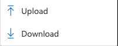

# Azure Environment Discovery

## 🎯 Purpose
This script collects **high-level information** about your Azure environment to provide a clear overview before diving into technical details.  
It helps identify:

- **Tenant information** (tenant name and ID)  
- **Subscriptions** (list of all subscriptions and their state)  
- **Owners** (who has Owner rights on each subscription)  
- **Plan / Offer type** (Pay-As-You-Go, Enterprise Agreement (EA), Microsoft Customer Agreement (MCA), Sponsored/Concierge, Dev/Test, etc.)  
- **Billing agreement type** (EA / MCA / PAYG, if available)

This “big picture” allows us to quickly understand **who owns what** and **what type of environment you are running**.

---

## 🛠️ What does the script do?
When you run the script, it will:

1. Connect to your Azure environment using **Azure Cloud Shell (Bash)**.  
2. Retrieve a list of tenants and subscriptions.  
3. Collect subscription policies such as OfferType, QuotaId, and SpendingLimit.  
4. Identify all **Owner role assignments** (including inherited permissions).  
5. Generate two output files with the collected data:  
   - **CSV file** → easy to open in Excel. 

---

## ✅ Prerequisites

To ensure full results, please verify you have the following permissions:

- **Reader** role on all subscriptions you want to map.  
- **Billing Reader** role on the billing account (to detect EA / MCA / PAYG).  
- Access to **Role Assignments** at the Management Group or Root level (to capture inherited Owner roles).  

---

## 🚀 How to Run

1. **Open the correct Azure Directory**  
   - Go to the Azure Portal.  
   - On the top-right, click **Directory + Subscription** and switch to the correct tenant (organization).

2. **Launch Azure Cloud Shell (Bash)**  
   - Click on the Cloud Shell icon in the top bar of the portal.  
   - Select **Bash** as the environment.  
   

3. **Run the script**  
   Copy and paste the following command:

   ```bash
   bash -c "$(curl -fsSL https://raw.githubusercontent.com/Guyashkenazi6/azure-env-discovery/refs/heads/main/azure-env-discovery.sh)"
   ```

The script will execute and generate the output files directly in your Cloud Shell home directory.

---

📂 Output Files

After running, you will find:
	•	azure_env_discovery_<timestamp>.csv → Excel-friendly table
---

📥 How to Download the Files

Download via Cloud Shell GUI

	•	In the Cloud Shell window, click the Download/Upload icon (📂⬇️).
	•	Select Download and choose your CSV file.
   

   


📤 How to Send Back the Files
	
 	•	Download the CSV file to your local machine (see above).
 	•	Send them back via email, Teams, or any other secure channel you prefer.

---

📌 Notes

	•	If some fields appear as MISSING, it usually means your account does not have the required permissions (e.g., Billing Reader).
	•	The script will not fail if information is missing – it will simply mark missing fields instead.
	•	The script only reads metadata; it does not modify or delete anything in your environment.

⚡ Quick Start (for advanced users)

If you are already in the correct tenant and Cloud Shell (Bash), just run:
```bash
bash -c "$(curl -fsSL https://raw.githubusercontent.com/Guyashkenazi6/azure-env-discovery/refs/heads/main/azure-env-discovery.sh)"
```
That’s it — you’ll get both CSV output ready to download.


# 🔑 How to Find the **Account Admin** in the Azure Portal

In some cases, the script cannot automatically retrieve the **Account Admin** (for example, with **MSDN**, **Pay-As-You-Go**, or legacy **EA** subscriptions).  
When this happens, the CSV will show guidance such as:  

- **"Check in Portal – classic subscription"**  
- **"Check in EA portal – Account Owner"**

👉 If you see one of these in the **CSV output**, follow the steps below to get the information manually.

---

## Step-by-Step Instructions

1. Sign in to the [Azure Portal](https://portal.azure.com).  
2. In the left-hand menu, go to **Subscriptions**.  
3. Select the **subscription** you want to check.
  
4. In the subscription’s menu, go to **Settings → Properties**.  
   - In some UI versions, you may just see **Properties** directly in the menu.
    
5. In the **Properties** blade, look for the field **Account admin**.  
  
6. Copy the email address shown there — this is the **Account Admin (Owner)** of the subscription.  

---

## Notes

- If the **Account Admin** looks like:  
  `user_domain#EXT#@tenant.onmicrosoft.com` → this means it’s an **External (Guest)** account.  
  The original email is usually `user@domain.com`.  
- For **Microsoft Customer Agreement (MCA)** or **CSP** subscriptions, there is no “Account Admin”.  
  - In these cases, ownership is managed in **Billing → Role assignments**.  
  - The script already shows this as **"Check in Billing (MCA)"** or **"Managed by partner – CSP"**.  
- If the field is not visible, you may not have permission. Ask someone with **Owner** or **Billing Reader** access to open the same page and share the value.

---


